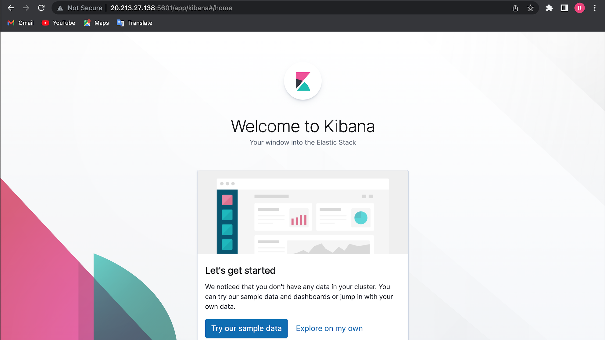
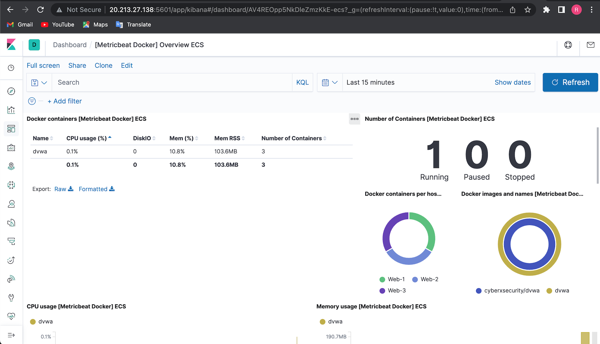

# Skills_Unlocked
## Automated ELK Stack Deployment

The files in this repository were used to configure the network depicted below.

These files have been tested and used to generate a live ELK deployment on Azure. They can be used to either recreate the entire deployment pictured above. Alternatively, select portions of the install-elk.yml file may be used to install only certain pieces of it, such as Filebeat.

- install-elk.yml

This document contains the following details:
- Description of the Topology
- Access Policies
- ELK Configuration
  - Beats in Use
  - Machines Being Monitored
- How to Use the Ansible Build

### Description of the Topology

The main purpose of this network is to expose a load-balanced and monitored instance of DVWA, the D*mn Vulnerable Web Application.

Load balancing ensures that the application will be highly effective, in addition to restricting traffic to the network.

What aspect of security do load balancers protect?

	Load balancers protect from Distributed Denial of Services (DDoS) attacks and distribute network load effectively and efficiently across the backend servers to ensure availability and reliability as demands dictates. 

What is the advantage of a jump box?
	
	The advantage of a properly configured jump box creates a highly restricted access to a network.  It creates a path from the internet to the intranet without exposing network of computers to the public.
	
Integrating an ELK server allows users to easily monitor the vulnerable VMs for changes to the network data and system logs.

What does Filebeat watch for?
	
	Filebeat, hence the name, collects data about the file system to monitor log files and log events.

What does Metricbeat record?

	Metricbeat records specific information about the machine operations in the network including but not limited to CPU usage, memory and uptime .

The configuration details of each machine may be found below.

|       Name         | Function   | IP Address | Operating System |
|--------------------|------------|------------|------------------|
| JumpBoxProvisioner |   Gateway  |  10.0.0.4  |       Linux      |
|       Web-1        |  Webserver |  10.0.0.5  |       Linux      |
|       Web-2        |  Webserver |  10.0.0.6  |       Linux      |
|       Web-3        |  Webserver |  10.0.0.7  |       Linux      |
|    ELKWatchTower   | ELK Server |  10.1.0.4  |       Linux      |

### Access Policies

The machines on the internal network are not exposed to the public Internet. 

Only the JumpBoxProvisioner virtual machine can accept connections from the Internet. Access to this machine is only allowed from the following IP addresses:

  Workstation pubic IP Address

Machines within the network can only be accessed by SSH.

Only the JumpBoxProvisioner with private IP Address of 10.0.0.4 is allowed to access my ELKWatchTower which is my ELK server.

A summary of the access policies in place can be found in the table below.

|       Name         |  Publicly Accessible  |  Allowed IP Addresses  |
|--------------------|-----------------------|------------------------|
| JumpBoxProvisioner |           No          | Workstation Public IP  |
|      Web-1         |           No          |        10.0.0.4        |
|      Web-2         |           No          |        10.0.0.4        |
|      Web-3         |           No          |        10.0.0.4        |
|    ELKWatchTower   |           No          |        10.0.0.4        |

### Elk Configuration

Ansible was used to automate configuration of the ELK machine. No configuration was performed manually, which is advantageous because automating configuration using Ansible provides efficiency of deploying different applications to multiple machines.

The playbook implements the following tasks:
  - Install docker.io
  - Install python3-pip
  - Install Docker python module
  - Increase virtual memory space
  - Download and launch ELK container
  - Start services upon boot

The following screenshot displays the result of running `docker ps` after successfully configuring the ELK instance.

### Target Machines & Beats
This ELK server is configured to monitor the following machines:

	Web-1	10.0.0.5
	Web-2 	10.0.0.6
	Web-3 	10.0.0.7

We have installed the following Beats on these machines:

  Filebeat
  Metricbeat
	

These Beats allow us to collect the following information from each machine:

	Filebeat monitors log files and log events while Metricbeat monitors machine operations and metrics like CPU usage and uptime for any suspicious activities.

### Using the Playbook
In order to use the playbook, you will need to have an Ansible control node already configured. Assuming you have such a control node provisioned: 

SSH into the control node and follow the steps below:
- Copy the install-elk.yml file to the directory /etc/ansible  
- Update the /etc/ansible/host file to include the IP address of the ELK server

- Run the playbook, SSH to the ELK server and run the command "curl http://localhost:5601/app/kibana and navigate to http://[ELKpublicip]:5601/app/kibana to check that the installation worked as expected.

Then:
- Copy the filebeat-playbook.yml and metricbeat-playbook.yml to /etc/ansible/roles
- Update the filebeat-config.yml and metricbeat-config.yml with the ELK server IP address
- Run the playbooks
- Navigate back to http://[ELKpublicip]:5601/app/kibana to check that the ELK server is running and monitoring the 3 webservers

Run the commands to download the configuration file for Filebeat (filebeat-config.yml) and Metricbeat (metricbeat-config.yml), respectively:

curl https://gist.githubusercontent.com/slape/5cc350109583af6cbe577bbcc0710c93/raw/eca603b72586fbe148c11f9c87bf96a63cb25760/Filebeat > /etc/ansible/filebeat-config.yml

curl https://gist.githubusercontent.com/slape/5cc350109583af6cbe577bbcc0710c93/raw/eca603b72586fbe148c11f9c87bf96a63cb25760/Metricbeat > /etc/ansible/metric-config.yml
