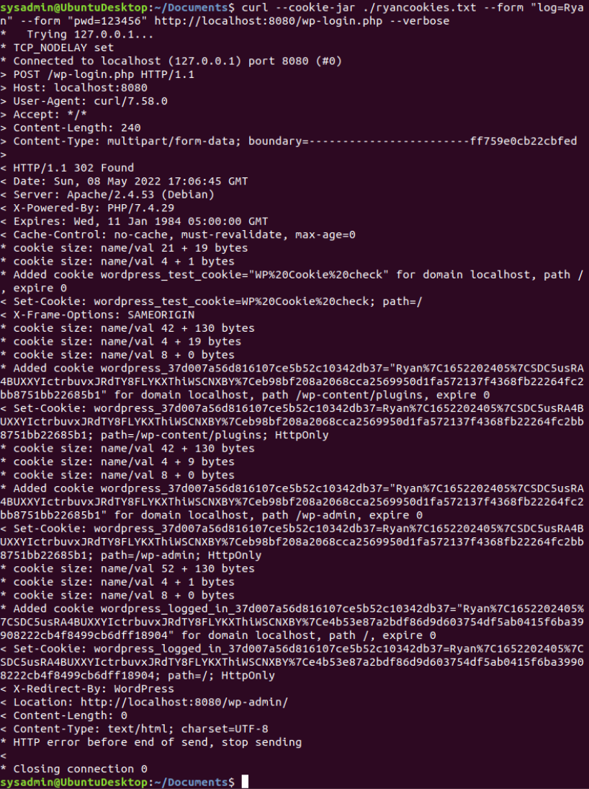
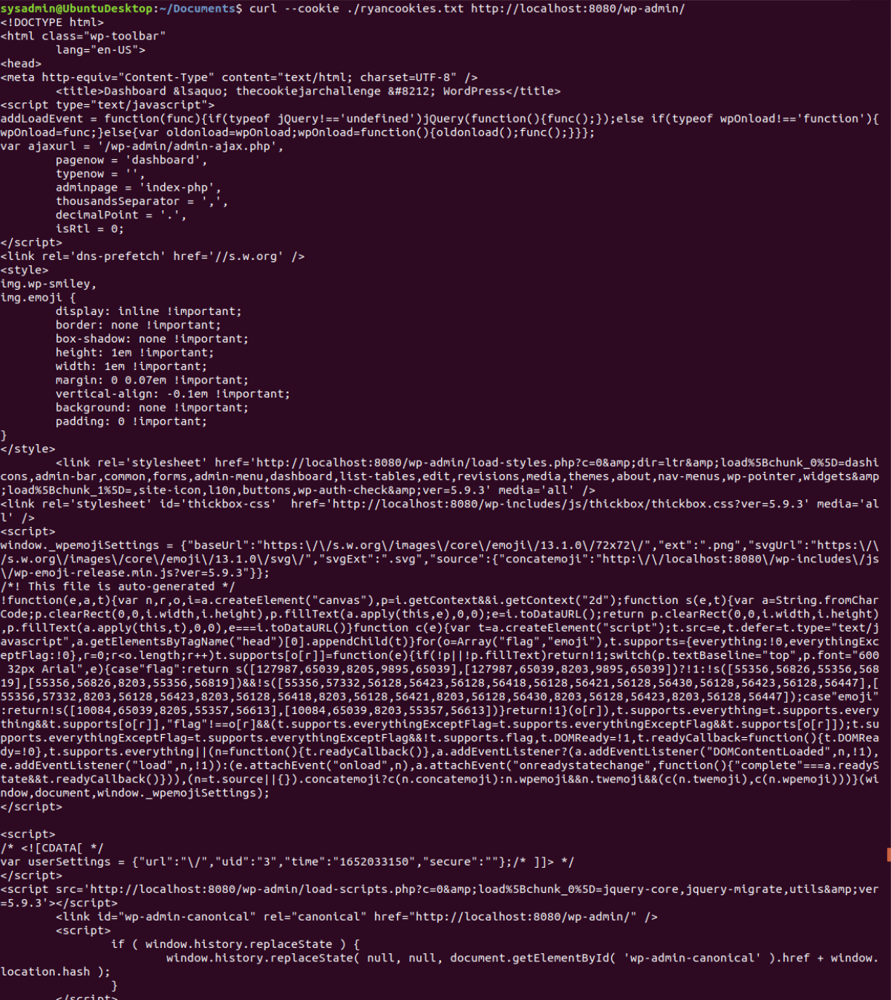
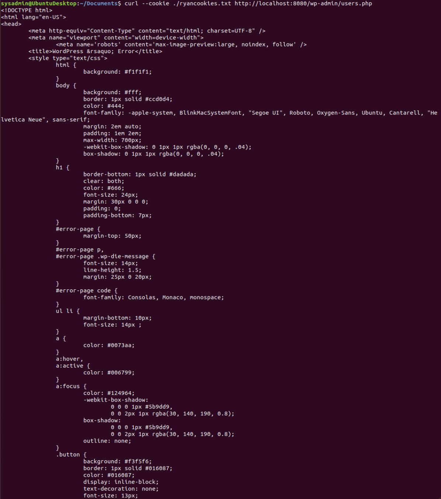
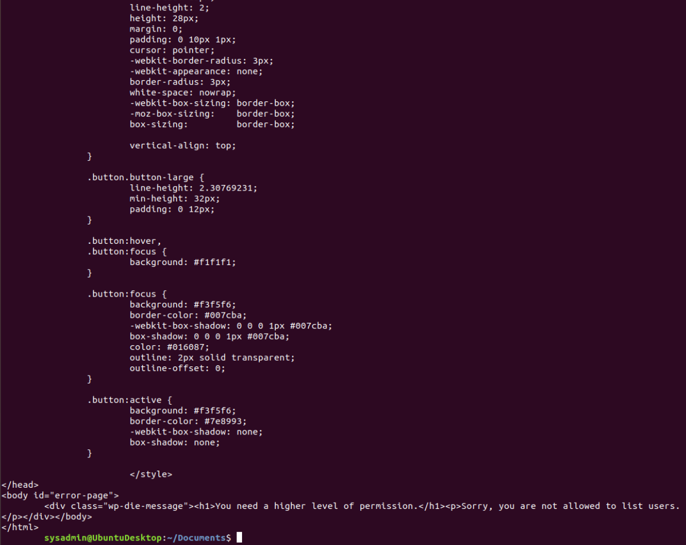

Week 14 Homework: Web Development

HTTP Requests and Responses

1.  What type of architecture does the HTTP request and response process occur in?
	
        Client-Server Model
        
2.  What are the different parts of an HTTP request?

        Request line, Headers and Request Body
        
3.  Which part of an HTTP request is optional?
      
        Request Body
        
4.  What are the three parts of an HTTP response?
      
        Status Line, Headers and Response Body
        
5.  Which number class of status codes represents errors?
      
        400s which denotes client errors and 500s for server errors
        
6.  What are the two most common request methods that a security professional will encounter?
      
        GET and POST requests
        
7.  Which type of HTTP request method is used for sending data?
	  
        POST
        
8.  Which part of an HTTP request contains the data being sent to the server?
      
        Request Line
        
9.  In which part of an HTTP response does the browser receive the web code to generate and style a web page?
      
        Response body
	
Using curl

10. What are the advantages of using curl over the browser?
	
        Curl is a fast and efficient way of pulling information from the internet without using a GUI.  It supports many different protocols including but not limited to HTTP, FTP, SFTP, IMAP, POP3, LDAP, SMB, SMTP.  It can be used for downloading files, listing contents of a directory, and fetching HTML headers.

11. Which curl option is used to change the request method?

         -X
         
12. Which curl option is used to set request headers?
	      
         -H
         
13. Which curl option is used to view the response header?

         -i
         
14. Which request method might an attacker use to figure out which HTTP requests and HTTP server will accept?
	    
        OPTIONS

Sessions and Cookies
Recall that HTTP servers need to be able to recognize clients from one another. They do this through sessions and cookies.

15. Which response header sends a cookie to the client?  
    HTTP/1.1 200 OK
    Content-type: text/html
    Set-Cookie: cart=Bob
    
        Set-Cookie: cart=Bob
	
16. Which request header will continue the client's session?  
    GET /cart HTTP/1.1
    Host: www.example.org
    Cookie: cart=Bob
    
        None indicated
        
Example HTTP Requests and Responses

Look through the following example HTTP request and response and answer the following questions:
HTTP Request
   POST /login.php HTTP/1.1
   Host: example.com
   Accept-Encoding: gzip, deflate, br
   Connection: keep-alive
   Content-Type: application/x-www-form-urlencoded
   Content-Length: 34
   Upgrade-Insecure-Requests: 1
   User-Agent: Mozilla/5.0 (Linux; Android 6.0; Nexus 5 Build/MRA58N) AppleWebKit/537.36 (KHTML, like Gecko) Chrome/80.0.3987.132 Mobile Safari/537.36

   username=Barbara&password=password
   
17. What is the request method?
	
        POST
        
18. Which header expresses the client's preference for an encrypted response?
	      
        Upgrade-Insecure-Requests: 1
        
19. Does the request have a user session associated with it?
	
        No.   It was not specified.
        
20. What kind of data is being sent from this request body?
	
        Login credentials
        
HTTP Response
  HTTP/1.1 200 OK
  Date: Mon, 16 Mar 2020 17:05:43 GMT
  Last-Modified: Sat, 01 Feb 2020 00:00:00 GMT
  Content-Encoding: gzip
  Expires: Fri, 01 May 2020 00:00:00 GMT
  Server: Apache
  Set-Cookie: SessionID=5
  Content-Type: text/html; charset=UTF-8
  Strict-Transport-Security: max-age=31536000; includeSubDomains
  X-Content-Type: NoSniff
  X-Frame-Options: DENY
  X-XSS-Protection: 1; mode=block

  [page content]
  
21. What is the response status code?
	
        200
        
22. What web server is handling this HTTP response?
	  
        Apache
        
23. Does this response have a user session associated to it?
	    
        Yes.  SessionID=5
        
24. What kind of content is likely to be in the [page content] response body?
	
        Content-Type: text/html
        
25. If your class covered security headers, what security request headers have been included?
	      
        Strict-Transport-Security: max-age=31536000; includeSubDomains
        
Monoliths and Microservices

26. What are the individual components of microservices called?
	
         Service.  It includes API, database, gateway.
         
27. What is a service that writes to a database and communicates to other services?
	
        Backend Server
        
28. What type of underlying technology allows for microservices to become scalable and have redundancy?
	    
        Load Balancer
        
Deploying and Testing a Container Set

29. What tool can be used to deploy multiple containers at once?
	
        Docker
        
30. What kind of file format is required for us to deploy a container set?
	      
        YAML file format
        
Databases

31. Which type of SQL query would we use to see all of the information within a table called customers?

        SELECT * FROM customers;

32. Which type of SQL query would we use to enter new data into a table? (You don't need a full query, just the first part of the statement.)
	
        INSERT INTO table_name (column_1, column_2, column_3) VALUES (value_1, value_2, value_3);

33. Why would we never run DELETE FROM <table-name>; by itself?
	
        It will delete the entire table containing significant data.

Bonus Challenge: The Cookie Jar

  First, using Docker Compose, navigate to the Day 1 WordPress activity directory and bring up the container set:
    /home/sysadmin/Documents/docker_files
  Using curl, you will do the following for the Ryan user:
  Log into WordPress and save the user's cookies to a cookie jar.
  Test a WordPress page by using a cookie from the cookie jar.
  Pipe the output from the cookie with grep to check for authenticated page access.
  Attempt to access a privileged WordPress admin page.

Step 1: Set Up
Create two new users: Amanda and Ryan.
1.  Navigate to localhost:8080/wp-admin/
2.  On the left-hand toolbar, hover over Users and click Add New.
3.  Enter the following information to create the new user named Amanda.
    Username: Amanda
    Email: amanda@email.com
4.  Skip down to password:
    Password: password
    Confirm Password: Check the box to confirm use of weak password.
    Role: Administrator
5.  Create another user named Ryan.
    Username: Ryan
    Email: ryan@email.com
6.  Skip down to password:
    Password: 123456
    Confirm Password: Check the box to confirm use of weak password.
    Role: Editor
7.  Log out and log in with the following credentials:
    Username: Amanda
    Password: password

Step 2: Baselining
For these "baselining" steps, you'll want to log into two different types of accounts to see how the WordPress site looks at the localhost:8080/wp-admin/users.php page. We want to see how the Users page looks from the perspective of an administrator, vs. a regular user.
1.  Using your browser, log into your WordPress site as your sysadmin account and navigate to localhost:8080/wp-admin/users.php, where we previously created the user Ryan. Examine this page briefly. Log out.
2.  Using your browser, log into your Ryan account and attempt to navigate to localhost:8080/wp-admin/index.php. Note the wording on your Dashboard.
3.  Attempt to navigate to localhost:8080/wp-admin/users.php. Note what you see now.
    Log out in the browser.

Step 3: Using Forms and a Cookie Jar
Navigate to ~/Documents in a terminal to save your cookies.
1.  Construct a curl request that enters two forms: "log={username}" and "pwd={password}" and goes to http://localhost:8080/wp-login.php. Enter Ryan's credentials where there are placeholders.
    Question: Did you see any obvious confirmation of a login? (Y/N) 
        
           N
  
 
  
2.  Construct the same curl request, but this time add the option and path to save your cookie: --cookie-jar ./ryancookies.txt. This option tells curl to save the cookies to the ryancookies.txt text file.
	

  
3.  Read the contents of the ryancookies.txt file.
    Question: How many items exist in this file? 
  
           Three

Step 4: Log in Using Cookies
1.  Craft a new curl command that now uses the --cookie option, followed by the path to your cookies file. For the URL, use http://localhost:8080/wp-admin/index.php.
    Question: Is it obvious that we can access the Dashboard? (Y/N) 
          
            Y

	
2.  Press the up arrow on your keyboard to run the same command, but this time, pipe | grep Dashboard to the end of your command to return all instances of the word Dashboard on the page.
    Question: Look through the output where Dashboard is highlighted. Does any of the wording on this page seem familiar? (Y/N) If so, you should be successfully logged in to your Editor's dashboard.

Step 5: Test the Users.php Page
1.  Finally, write a curl command using the same --cookie ryancookies.txt option, but attempt to access http://localhost:8080/wp-admin/users.php.
    Question: What happens this time? 
      
           Error

