Unit 15 Homework: Web Vulnerabilities and Hardening

Web Application 1: Your Wish is My Command Injection

This page is a new web application built by Replicants in order to enable their customers to ping an IP address. The web page will return the results of the ping command back to the user.
This type of injection attack is called Command Injection, and it is dependent on the web application taking user input to run a command against an operating system.
Now that you have determined that Replicants new application is vulnerable to command injection, you are tasked with using the dot-dot-slash method to design two payloads that will display the contents of the following files:

/etc/passwd

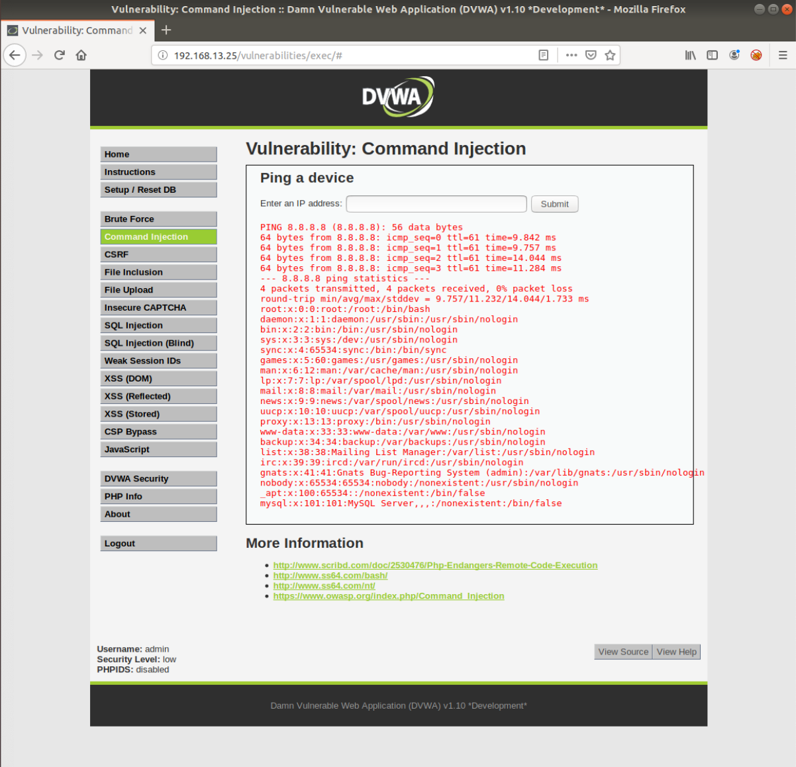

/etc/hosts

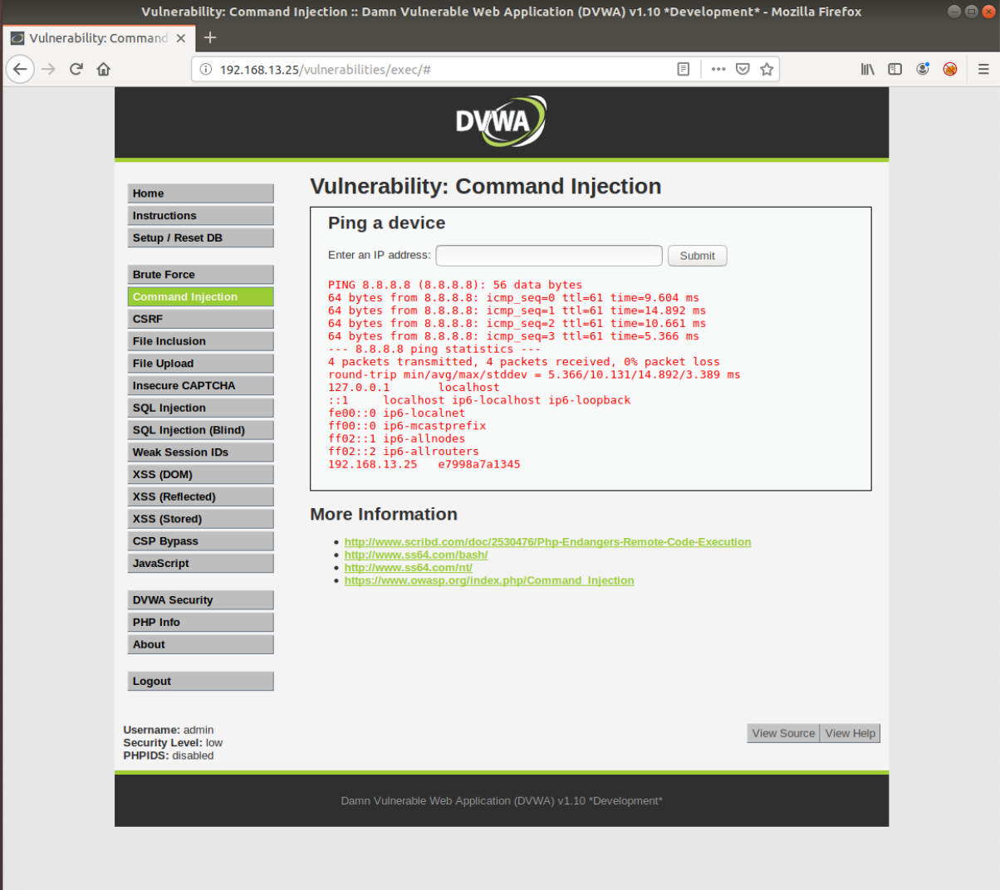

Mitigation Strategies:

    Limit input from user and input validation.  In this case the web application is calling for IP address/es, input should be limited to IP address/es strings and should return an error for anything that is otherwise specified.  Restrict web server accessibility following the principle of least privilege to prevent confidential information access.

Web Application 2: A Brute Force to Be Reckoned With
Complete the following steps to set up the activity.

Open a browser on Vagrant and navigate to the webpage http://192.168.13.35/install.php.
This page is an administrative web application that serves as a simple login page. An administrator enters their username and password and selects Login.

If the user/password combination is correct, it will return a successful message.

If the user/password combination is incorrect, it will return the message, "Invalid credentials."

Years ago, Replicants had a systems breach and several administrators passwords were stolen by a malicious hacker. The malicious hacker was only able to capture a list of passwords, not the associated accounts' usernames. Your manager is concerned that one of the administrators that accesses this new web application is using one of these compromised passwords. Therefore, there is a risk that the malicious hacker can use these passwords to access an administrator's account and view confidential data.
Use the web application tool Burp Suite, specifically the Burp Suite Intruder feature, to determine if any of the administrator accounts are vulnerable to a brute force attack on this web application.

You've been provided with a list of administrators and the breached passwords:

List of Administrators
Breached list of Passwords

Generate a login request and capture the traffic using Burp Suite.  Send the HTTP request to Burp Intruder.

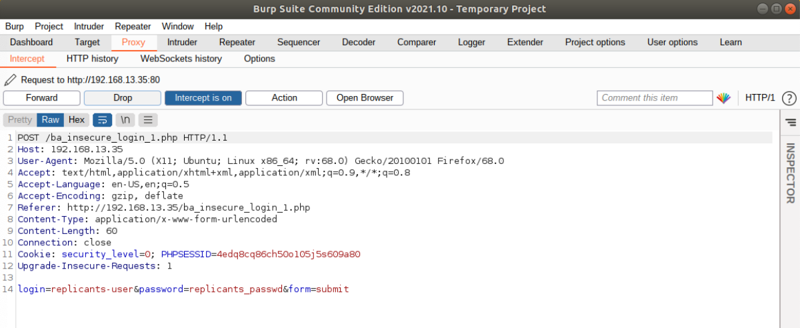

Identify the payload positions which is the username and password 

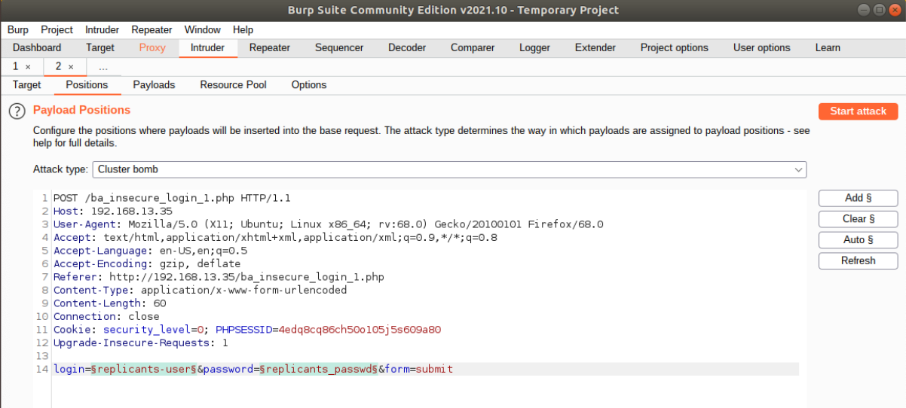

Update the Burp Intruder username payload for payload set 1

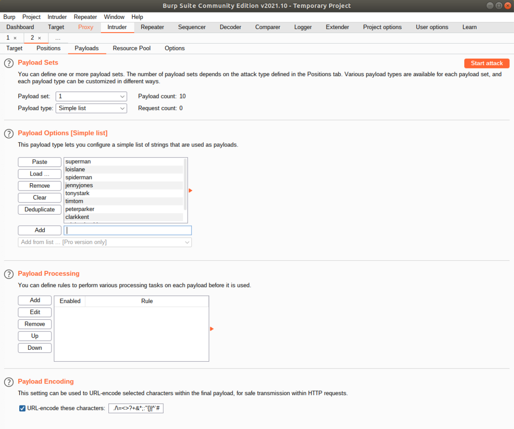

Updated the Burp Intruder password payload for payload set 2

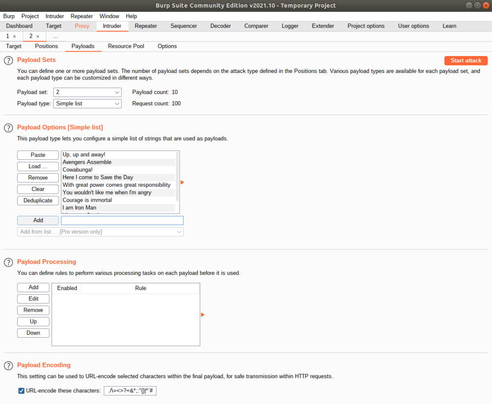

Successful brute force attack. Image showing the successful payload combination.

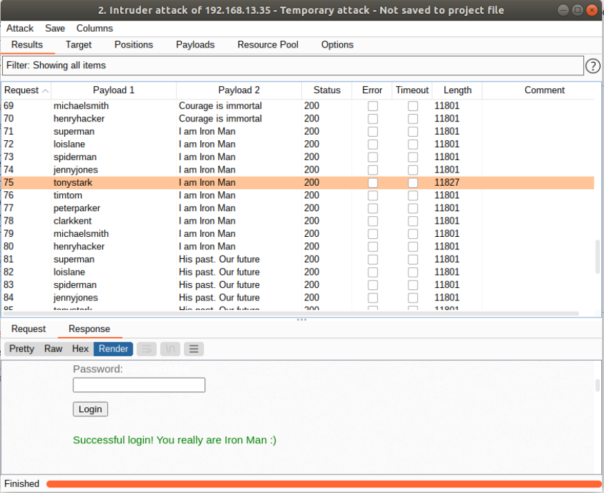

Mitigation Strategies:
        
        Complex username and password,  Multi-Factor authentication, CAPTCHA to slow down credential stuffing, prevent automated login and lock accounts after several failed attempts.

Web Application 3: Where's the BeEF?

Task details:

The page you will test is the Replicants Stored XSS application which was used the first day of this unit: http://192.168.13.25/vulnerabilities/xss_s/
The BeEF hook, which was returned after running the sudo beef command was: http://127.0.0.1:3000/hook.js
The payload to inject with this BeEF hook is: 
When you attempt to inject this payload, you will encounter a client-side limitation that will not allow you to enter the whole payload. You will need to find away around this limitation.

Max Character set limit is 50.

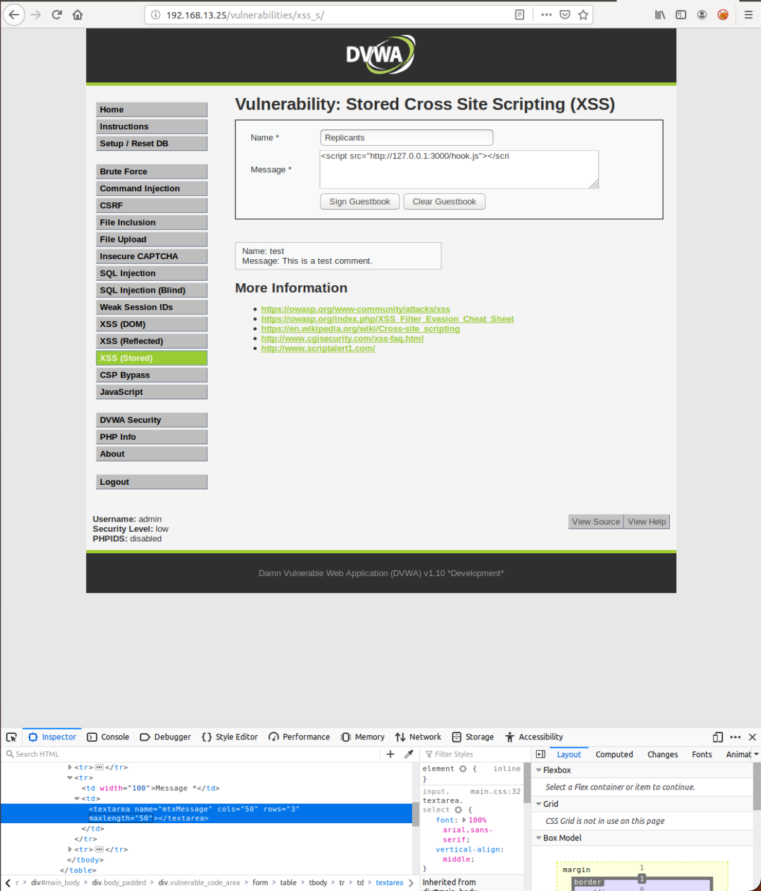

Increase max character limit to 75 to successfully inject script.

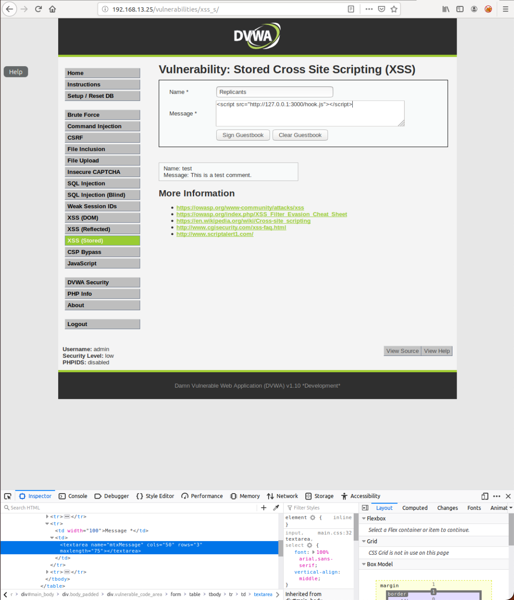

Verify that the script is successfully embedded.

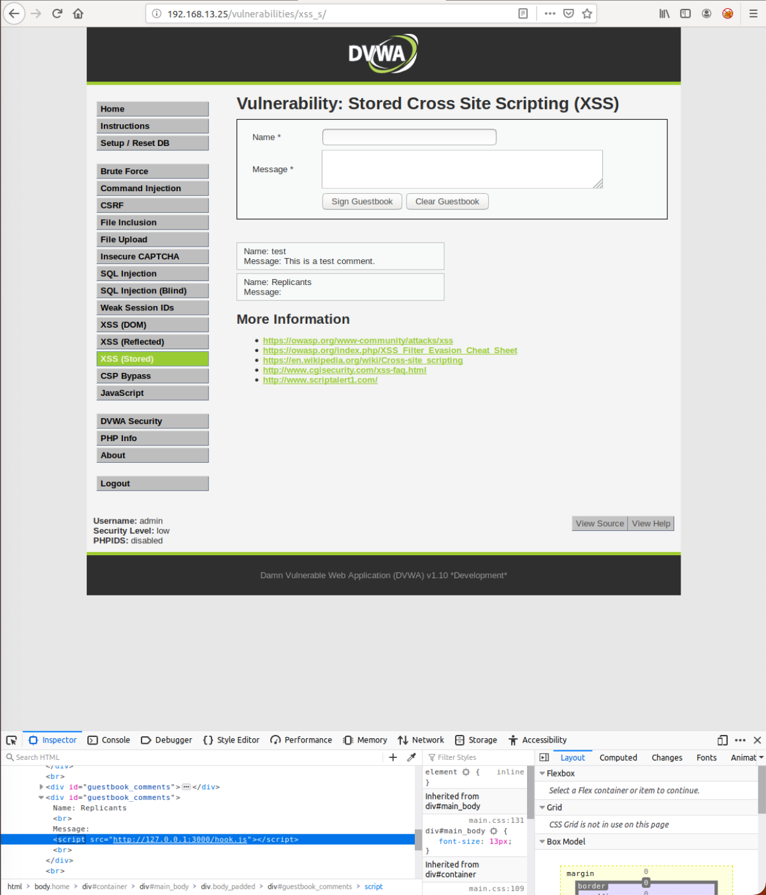

Social Engineering >> Pretty Theft

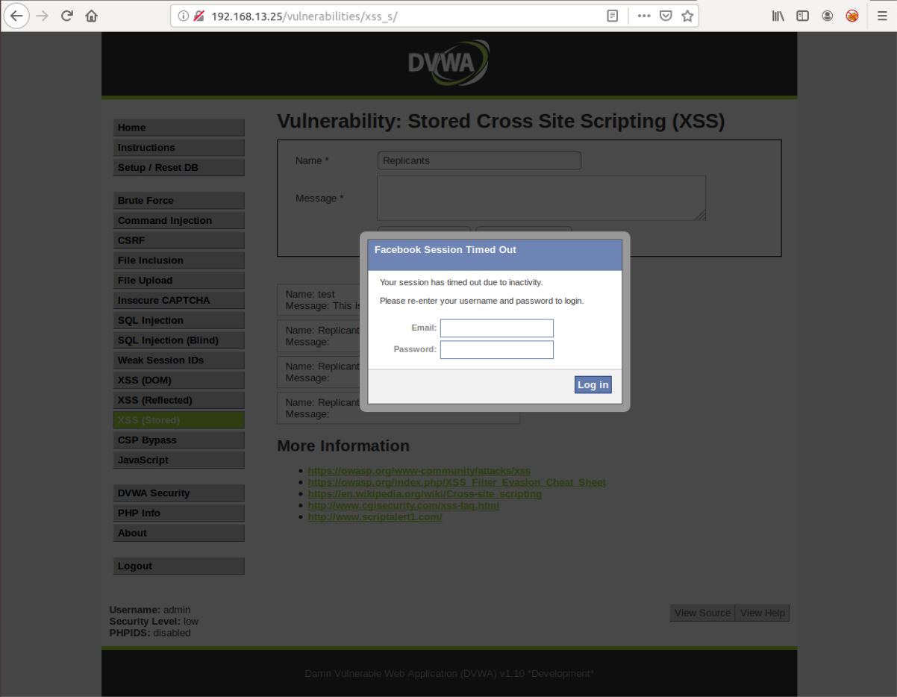

Social Engineering >> Fake Notification Bar

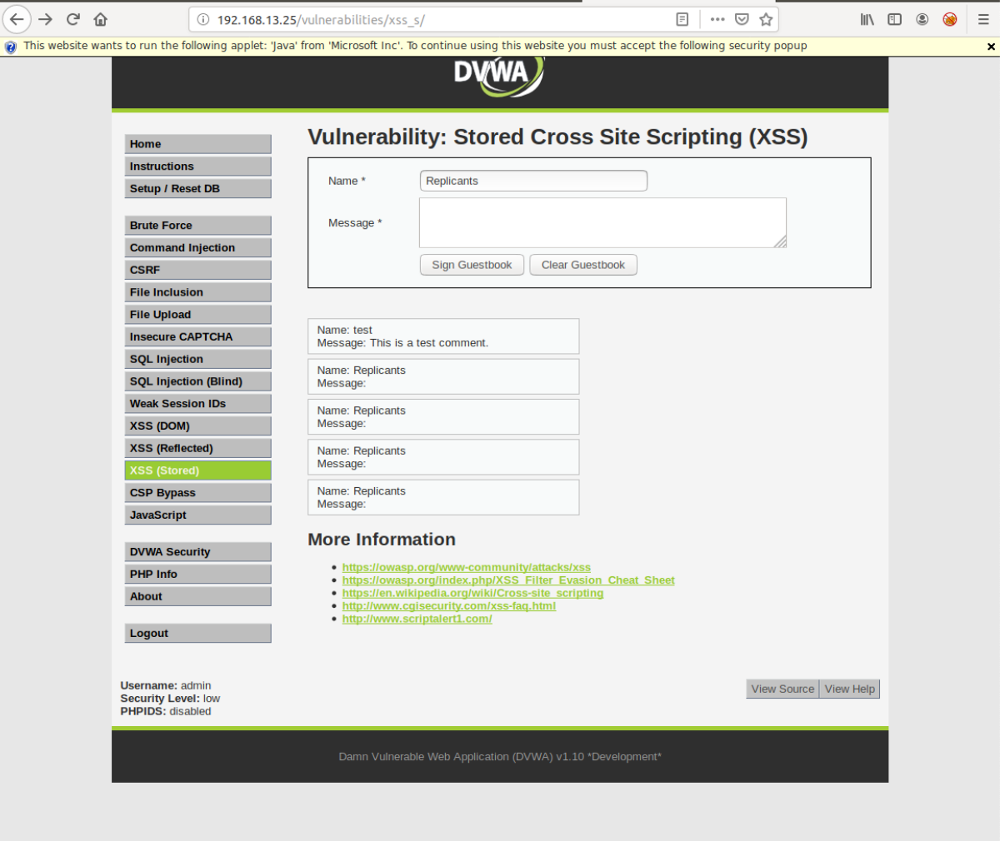

Host >> Get Geolocation (Third Party)

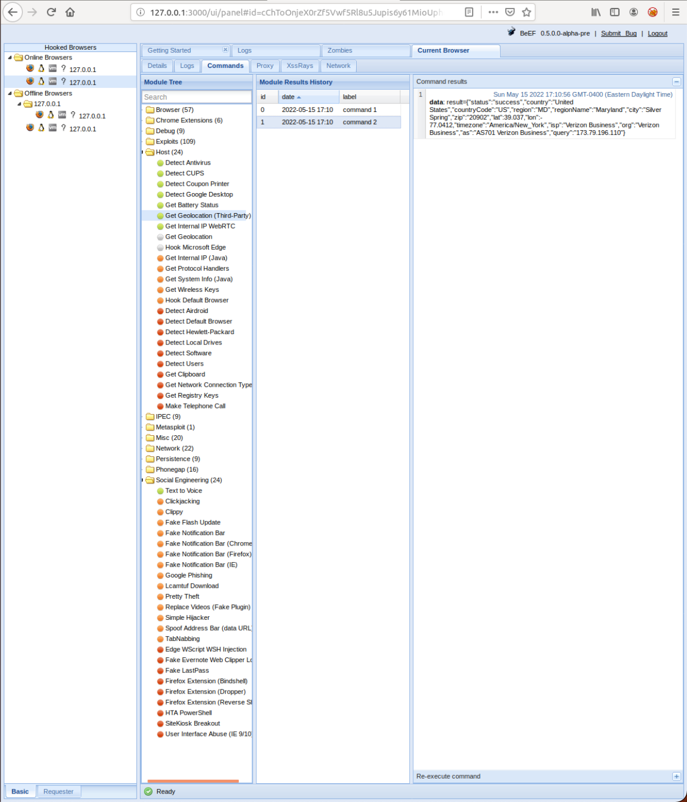

Mitigation Strategy:

    Service-side input validation to prevent scripts from being stored on web applications.
