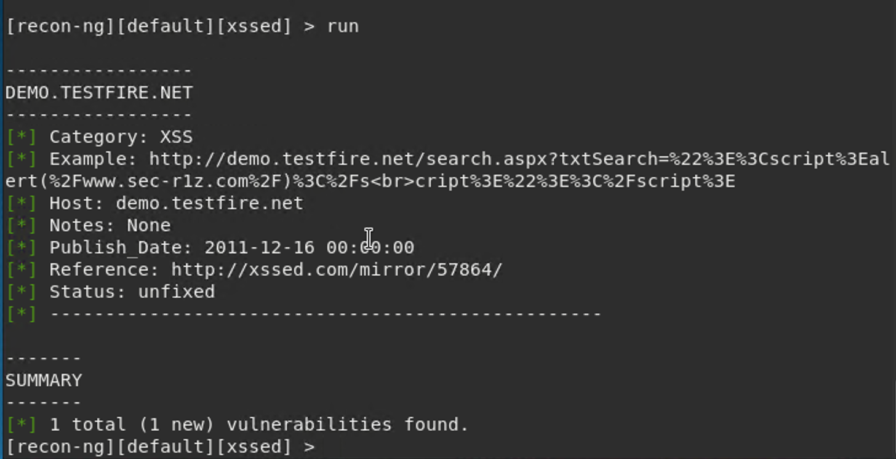
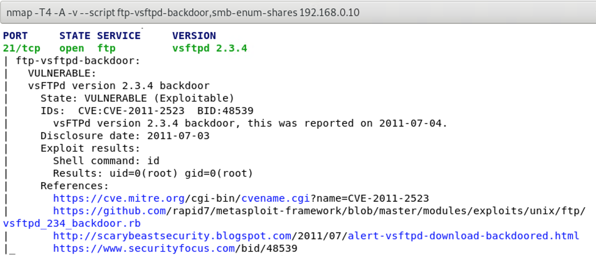
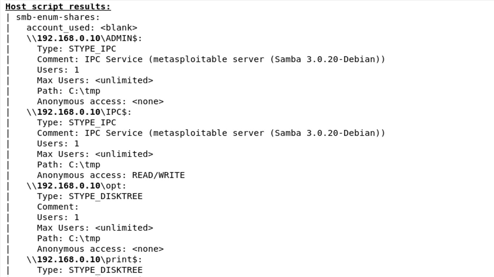
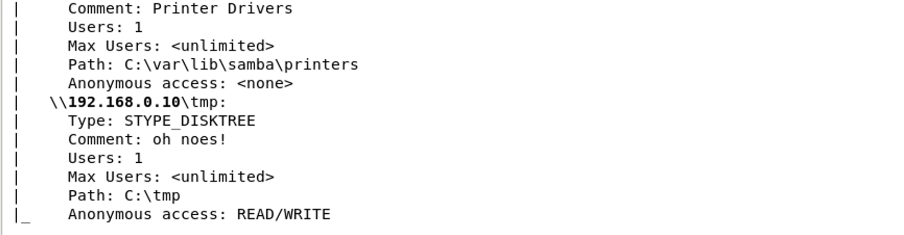

Week 16 Homework Submission File: Penetration Testing 1
Step 1: Google Dorking

Using Google, can you identify who the Chief Executive Officer of Altoro Mutual is:

        Karl Fitzgerald is the Chairman & Chief Executive Officer.
      
How can this information be helpful to an attacker:

        This information is helpful to the attacker for spear phishing.  CEOs have privileged access to their company and attackers can use this for “whaling attack” which is a type of spear phishing that targets the company executive to get access to sensitive information.  Another  possibility is to execute another type of spear phishing where the attacker can impersonate the company CEO to target another of the company’s employees to reveal confidential information.

Step 2: DNS and Domain Discovery
Enter the IP address for demo.testfire.net into Domain Dossier and answer the following questions based on the results:
1.  Where is the company located:

         Sunnyvale, CA 94085
     
2.  What is the NetRange IP address:

         65.61.137.64 - 65.61.137.127
    
3.  What is the company they use to store their infrastructure:

       	 Rackspace Backbone Engineering in 
       	 9725 Datapoint Drive, Suite 100
       	 San Antonio, TX  78229

4.  What is the IP address of the DNS server:

         65.61.137.117

Step 3: Shodan
What open ports and running services did Shodan find:
	
         80, 443, 8080
        
Step 4: Recon-ng
Install the Recon module xssed.
	
   	 recon-ng
         marketplace install xssed
         modules load recon/domains-vulnerabilities/xssed

Set the source to demo.testfire.net.
	
   	 options set SOURCE demo.testfire.net
  
Run the module.
	
    	 run
    
Is Altoro Mutual vulnerable to XSS:

       	 Yes.
   

Step 5: Zenmap
Your client has asked that you help identify any vulnerabilities with their file-sharing server. Using the Metasploitable machine to act as your client's server, complete the following:
Command for Zenmap to run a service scan against the Metasploitable machine:

    	sudo zenmap
   	Set Target: 192.168.0.10 (which is the IP of Metasploitable machine)
   	Set Profile: Intense scan
   	Command: nmap -T4 -A -v 192.168.0.10
    
Bonus command to output results into a new text file named zenmapscan.txt:

   	nmap -T4 -A -v 192.168.0.10 -oN zenmapscan.txt
    
Zenmap vulnerability script command:

    	nmap -T4 -A -v --script ftp-vsftpd-backdoor,smb-enum-shares 192.168.0.10

Once you have identified this vulnerability, answer the following questions for your client:

1.  What is the vulnerability:

        I executed two scripts.
	

2.  Why is it dangerous:

        For vsftpd 2.3.4 vulnerability, it is a malicious backdoor that was added to the VSFTPD download archive. This backdoor was present in the vsftpd-2.3.4.tar.gz archive sometime before July 3, 2011.  A remote attacker can therefore use this backdoor, in order to access the system.
        As for SMB enumeration vulnerability, finding open shares is dangerous because there may be private files shared, or, if it's writable as is the case shown, it could be a good place to drop malware or to infect a file that's already there. 

3.  What mitigation strategies can you recommendations for the client to protect their server:

        For vsftpd 2.3.4 backdoor vulnerability, update to the newest version of vsftpd which has been patched.
        And for SMB enumeration vulnerability, update and patch against SMB vulnerabilities, protect data and use encryption, use secure authentication methods, block SMB at the network level, restrict and protect SMB at the host level.
