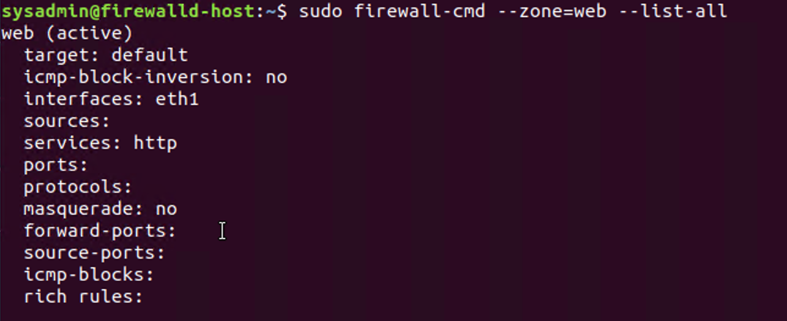
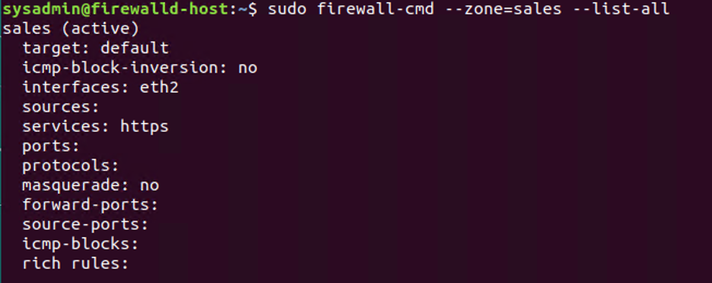
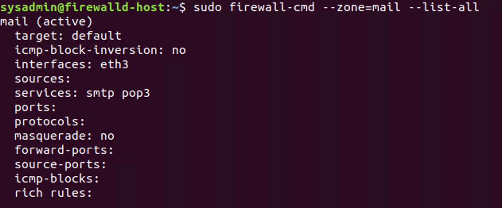

Unit 11: Network Security

Part 1:

Security Control Types
The concept of defense in depth can be broken down into three different security control types. Identify the security control type of each set of defense tactics.

1.  Walls, bollards, fences, guard dogs, cameras, and lighting are what type of security control?

        Physical Control
2.  Security awareness programs, BYOD policies, and ethical hiring practices are what type of security control?

        Administrative Control
        
3.  Encryption, biometric fingerprint readers, firewalls, endpoint security, and intrusion detection systems are what type of security control?
        
        Technical Control

Intrusion Detection and Attack indicators
1.  What's the difference between an IDS and an IPS?

        IDS passively logs information to be analyzed but doesn’t mitigate an attack which requires an administrator to man the network traffic and intervene while IPS monitors network traffic as the IDS but responds to attack by blocking malicious traffic without an administrator.
  
2.  What's the difference between an Indicator of Attack and an Indicator of Compromise?

        IOA indicates an attack that is currently happening wherein a full breach is undetermined at the time while IOC indicates an attack that has already occurred or already compromised and a breach has been determined that a person can identify the tactics of the hacker who infiltrated the system and can develop a mitigation strategy based on what has occurred.

The Cyber Kill Chain

Name each of the seven stages for the Cyber Kill chain and provide a brief example of each.

    Stage 1: Reconnaissance - based on the identified target, the attacker will gather information prior to attack possibly scouring the Internet for any public information available including contact information such email addresses
    Stage 2: Weaponization - based on the reconnaissance, the attacker will then determine how to exploit the vulnerabilities discovered ranging from use of social engineering, malware or exploiting zero-day vulnerability
    Stage 3: Delivery -  ways to get your weapon through the door or gain entry to the target’s environment via email attachment, keylogger or removable media like USB
    Stage 4: Exploitation - method on how to capitalize on the vulnerability found in the target’s environment either on a software, operating system or zero-day exploits
    Stage 5: Installation - how to  get your weapon to run on your target’s system possibly through an automatic execution of code when the target plugs the USB and establish persistence through backdoor entry
    Stage 6: Command and Control - an attacker have access to the victim’s environment wherein they can execute their own command using the resources of their victim
    Stage 7: Actions on Objectives - an attacker technically owns the victim’s compromised system and can execute whatever intention he has initially or possibly move laterally to cover more ground in the victim’s network to compromise more system

Snort Rule Analysis

Snort Rule #1

alert tcp $EXTERNAL_NET any -> $HOME_NET 5800:5820 (msg:"ET SCAN Potential VNC Scan 5800-5820"; flags:S,12; threshold: type both, track by_src, count 5, seconds 60; reference:url,doc.emergingthreats.net/2002910; classtype:attempted-recon; sid:2002910; rev:5; metadata:created_at 2010_07_30, updated_at 2010_07_30;)

1.  Break down the Snort Rule header and explain what is happening.

        Snort Rule Header:
          alert tcp $EXTERNAL_NET any -> $HOME_NET 5800:5820

        Creates an alert that applies to all tcp packets from any ip address and any port going to any home ip address and ports ranging from 5800 to 5820

2.  What stage of the Cyber Kill Chain does this alert violate?

        Reconnaissance
        
3.  What kind of attack is indicated?

        Potential VNC(Virtual Network Computing - to remotely control another computer) scan

Snort Rule #2

alert tcp $EXTERNAL_NET $HTTP_PORTS -> $HOME_NET any (msg:"ET POLICY PE EXE or DLL Windows file download HTTP"; flow:established,to_client; flowbits:isnotset,ET.http.binary; flowbits:isnotset,ET.INFO.WindowsUpdate; file_data; content:"MZ"; within:2; byte_jump:4,58,relative,little; content:"PE|00 00|"; distance:-64; within:4; flowbits:set,ET.http.binary; metadata: former_category POLICY; reference:url,doc.emergingthreats.net/bin/view/Main/2018959; classtype:policy-violation; sid:2018959; rev:4; metadata:created_at 2014_08_19, updated_at 2017_02_01;)

1.  Break down the Snort Rule header and explain what is happening.

        Snort Rule Header:
          alert tcp $EXTERNAL_NET $HTTP_PORTS -> $HOME_NET any

        Creates an alert that applies to all tcp packets from any ip address and port 80 going to any home ip address and any port

2.  What layer of the Defense in Depth model does this alert violate?

        Host Computer
        
3.  What kind of attack is indicated?

        Possible malware trying to interact with a host computer by accessing dll files for remote access
        
Snort Rule #3

Write a Snort rule that alerts when traffic is detected inbound on port 4444 to the local network on any port. 

        alert tcp $EXTERNAL_NET 4444 -> $HOME_NET any (msg:”TCP Packet detected from port 4444”;)
        
Part 2: "Drop Zone" Lab

Uninstall ufw
Before getting started, you should verify that you do not have any instances of ufw running. This will avoid conflicts with your firewalld service. This also ensures that firewalld will be your default firewall.

Run the command that removes any running instance of ufw.
          
        $ sudo ufw disable
        
Enable and start firewalld

By default, these services should be running. If not, then run the following commands:

Run the commands that enable and start firewalld upon boots and reboots.

        $ sudo systemctl enable firewalld 
        $ sudo systemctl start firewalld

Note: This will ensure that firewalld remains active after each reboot.

Confirm that the service is running.

Run the command that checks whether or not the firewalld service is up and running.

        $ sudo systemctl status firewalld

List all firewall rules currently configured.

Next, lists all currently configured firewall rules. This will give you a good idea of what's currently configured and save you time in the long run by not doing double work.

Run the command that lists all currently configured firewall rules:

        $ sudo firewall-cmd --list-all

Take note of what Zones and settings are configured. You may need to remove unneeded services and settings.

List all supported service types that can be enabled.

Run the command that lists all currently supported services to see if the service you need is available

        $ sudo firewall-cmd --get-services
        
We can see that the Home and Drop Zones are created by default.
Zone Views
Run the command that lists all currently configured zones.

        $ sudo firewall-cmd --get-zones
        
We can see that the Public and Drop Zones are created by default. Therefore, we will need to create Zones for Web, Sales, and Mail.

Create Zones for Web, Sales and Mail.

Run the commands that create Web, Sales and Mail zones.

        $ sudo firewall-cmd --permanent --new-zone=web
        $ sudo firewall-cmd --permanent --new-zone=sales
        $ sudo firewall-cmd --permanent --new-zone=mail
        
Set the zones to their designated interfaces:

Run the commands that set your eth interfaces to your zones.

        $ sudo firewall-cmd --zone=public --change-interface=eth0
        $ sudo firewall-cmd --zone=web --change-interface=eth1
        $ sudo firewall-cmd --zone=sales --change-interface=eth2 
        $ sudo firewall-cmd --zone=mail --change-interface=eth3
        
Add services to the active zones:

Run the commands that add services to the public zone, the web zone, the sales zone, and the mail zone.
Public:
	
        $ sudo firewall-cmd --zone=public --add-service=http
        $ sudo firewall-cmd --zone=public --add-service=https
        $ sudo firewall-cmd --zone=public --add-service=pop3
        $ sudo firewall-cmd --zone=public --add-service=smtp
        
Web:

	      $ sudo firewall-cmd --zone=web --add-service=http
        
Sales
	
        $ sudo firewall-cmd --zone=sales --add-service=https
        
Mail
        
        $ sudo firewall-cmd --zone=mail --add-service=smtp
        $ sudo firewall-cmd --zone=mail --add-service=pop3
        
What is the status of http, https, smtp and pop3? As directed:

Add your adversaries to the Drop Zone.

Run the command that will add all current and any future blacklisted IPs to the Drop Zone.

        $ sudo firewall-cmd --zone=drop --add-source=10.208.56.23
        $ sudo firewall-cmd --zone=drop --add-source=135.95.103.76
        $ sudo firewall-cmd --zone=drop --add-source=76.34.169.118
        
Make rules permanent then reload them:

It's good practice to ensure that your firewalld installation remains nailed up and retains its services across reboots. This ensures that the network remains secured after unplanned outages such as power failures.

Run the command that reloads the firewalld configurations and writes it to memory

        $ sudo firewall-cmd --reload && sudo firewall-cmd --runtime-to-permanent
        
View active Zones

Now, we'll want to provide truncated listings of all currently active zones. This is a good time to verify your zone settings.

Run the command that displays all zone services.

        $ sudo firewall-cmd --list-all-zones
        
Block an IP address

Use a rich-rule that blocks the IP address 138.138.0.3.

        $ sudo firewall-cmd --permanent --add-rich-rule=”rule family=’ipv4’ source address=’138.138.0.3’ reject”
        
Block Ping/ICMP Requests

Harden your network against ping scans by blocking icmp echo replies.

Run the command that blocks pings and icmp requests in your public zone.

        $ sudo firewall-cmd --zone=public --add-icmp-block=echo-reply --add-icmp-block=echo-request
        
Rule Check

Now that you've set up your brand new firewalld installation, it's time to verify that all of the settings have taken effect.

Run the command that lists all of the rule settings. Do one command at a time for each zone.

        $ sudo firewall-cmd --zone=public --list-all
        $ sudo firewall-cmd --zone=web --list-all
        $ sudo firewall-cmd --zone=sales --list-all
        $ sudo firewall-cmd --zone=mail --list-all
        $ sudo firewall-cmd --zone=drop --list-all
        
Are all of our rules in place? If not, then go back and make the necessary modifications before checking again.
Congratulations! You have successfully configured and deployed a fully comprehensive firewalld installation.

Part 3: IDS, IPS, DiD and Firewalls

Now, we will work on another lab. Before you start, complete the following review questions.

IDS vs. IPS Systems
1.  Name and define two ways an IDS connects to a network.

        Network TAP (Test Access Port)
        Port Mirroring (SPAN- Switched Port Analyzer)
    
2.  Describe how an IPS connects to a network.
 
        Inline with the flow of data between the firewall and network switch
    
3.  What type of IDS compares patterns of traffic to predefined signatures and is unable to detect Zero-Day attacks?

        Signature-based IDS
    
4.  Which type of IDS is beneficial for detecting all suspicious traffic that deviates from the well-known baseline and is excellent at detecting when an attacker probes or sweeps a network?
    
        Anomaly-based IDS
    
Defense in Depth
1.  For each of the following scenarios, provide the layer of Defense in Depth that applies:
      1.  A criminal hacker tailgates an employee through an exterior door into a secured facility, explaining that they forgot their badge at home.
    
              Physical
    
      2.  A zero-day goes undetected by antivirus software.

              Network
    
      3.  A criminal successfully gains access to HR’s database.

              Data
    
      4.  A criminal hacker exploits a vulnerability within an operating system.
   
              Application
    
      5.  A hacktivist organization successfully performs a DDoS attack, taking down a government website.

              Network
    
      6.  Data is classified at the wrong classification level.

              Data
    
      7.  A state sponsored hacker group successfully firewalked an organization to produce a list of active services on an email server.

              Network
    
2.  Name one method of protecting data-at-rest from being readable on hard drive.

        Hard drive encryption like Bitlocker or FileVault
        
3.  Name one method to protect data-in-transit.
  
        Encryption with authentication using symmetric/asymmetric keys
        
4.  What technology could provide law enforcement with the ability to track and recover a stolen laptop.
  
        GPS tracking chips or through the IP address when the stolen laptop access the internet
        
5.  How could you prevent an attacker from booting a stolen laptop using an external hard drive?
    
         Strong password and full disk encryption on the laptop
         
Firewall Architectures and Methodologies
1.  Which type of firewall verifies the three-way TCP handshake? TCP handshake checks are designed to ensure that session packets are from legitimate sources.
    
        Circuit-level Firewall
2.  Which type of firewall considers the connection as a whole? Meaning, instead of looking at only individual packets, these firewalls look at whole streams of packets at one time.
    
        Stateful Packet-Filtering Firewall
        
3.  Which type of firewall intercepts all traffic prior to being forwarded to its final destination. In a sense, these firewalls act on behalf of the recipient by ensuring the traffic is safe prior to forwarding it?

        Proxy(Application) Firewall
        
4.  Which type of firewall examines data within a packet as it progresses through a network interface by examining source and destination IP address, port number, and packet type- all without opening the packet to inspect its contents?

         Stateless Packet-Filtering Firewall
         
5.  Which type of firewall filters based solely on source and destination MAC address?

         MAC Layer Firewall
    
Bonus Lab: "Green Eggs & SPAM"
In this activity, you will target spam, uncover its whereabouts, and attempt to discover the intent of the attacker.

You will assume the role of a Jr. Security administrator working for the Department of Technology for the State of California.

As a junior administrator, your primary role is to perform the initial triage of alert data: the initial investigation and analysis followed by an escalation of high priority alerts to senior incident handlers for further review.

You will work as part of a Computer and Incident Response Team (CIRT), responsible for compiling Threat Intelligence as part of your incident report.

Threat Intelligence Card
Locate the following Indicator of Attack in Sguil based off of the following:
  Source IP/Port: 188.124.9.56:80
  Destination Address/Port: 192.168.3.35:1035
  Event Message: ET TROJAN JS/Nemucod.M.gen downloading EXE payload

1.   What was the indicator of an attack?

         According to the Snort alert, it reveals a Trojan malware via an executable file that is downloading
         
2.  What was the adversarial motivation (purpose of attack)?
    
          To gain access to the system using a Trojan malware disguised as a legitimate program
          
3.  Describe observations and indicators that may be related to the perpetrators of the intrusion. Categorize your insights according to the appropriate stage of the cyber kill chain, as structured in the following table.

| TTP       | Example          | Findings  |
| ------------- |:-------------:| -----:|
| Reconnaissance     | How did the attacker locate the victim? | Possibly through a bait attack using a phishing email |
| Weaponization     | What was it that was downloaded?     | A file containing a Trojan Malware |
| Delivery | How was it downloaded?      | Possibly through a phishing email or being redirected to a malicious website |
| Exploitation | What does the exploit do?      | Gain access to the victim’s computer, information and credentials|
| Installation | How is the exploit installed?      | When the victim downloads and executes the file the Malware is installed in the background. |
| Command & Control (C2) |How does the attacker gain control of the remote machine?     | Once the Trojan malware is installed it can be used to spy on the victims movement in the computer, steal their credentials|
| Actions on Objectives   | What does the software that the attacker sent do to complete it's tasks?   | Install backdoor access for persistence |
  

4.  What are your recommended mitigation strategies?

        Aside from having an IDS/IPS, never open an email attachment or run a program from an untrusted source, keep operating system and browser up to date, install an antivirus software

5.  List your third-party references.
  
        Snort alert, Kibana IP Lookup https://www.virustotal.com/gui/file/6cb50ecb44007c42666958ae58d724505fdd6414fd574ea5cc6e5cf03c640ec0/community

