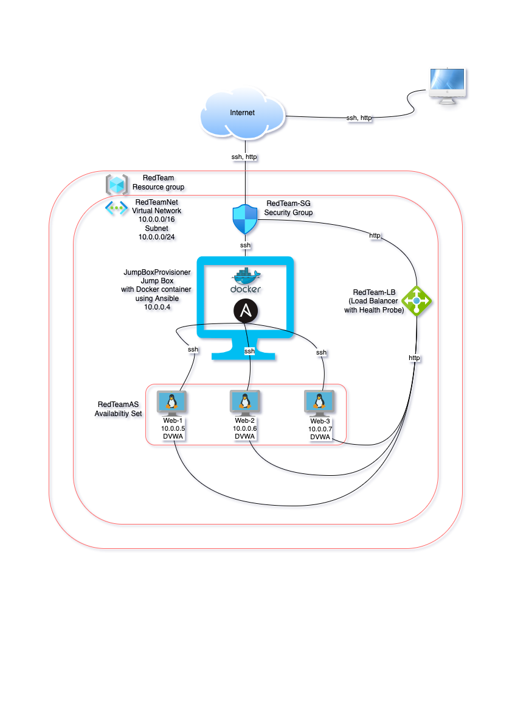

Cloud Recap
When you're finished completing all the activities in cloud week, you should have:

A total of 3 VMs running DVWA.

All 3 VMs receiving traffic from your load balancer.

Both VMs receiving traffic from your load balancer.

You should have a network diagram that shows your entire cloud setup, including your Ansible jump box and the Docker containers running on each VM.

Your diagram should show the following:

Azure resource group
Virtual network with IP address range
Subnet range
Flow of specific traffic (e.g., HTTP, SSH)
Security group blocking traffic
Load balancer
All 4 VMs that you have launched
Where Docker and Ansible are deployed

