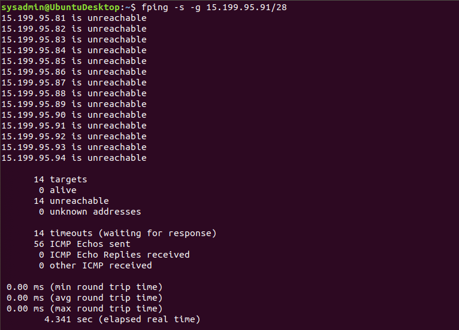

Phase 1: "I'd like to Teach the World to Ping"
List the steps and commands used to complete the tasks.

    fping -s -g 15.199.95.91/28
    
    

    fping -s -g 15.199.94.91/28

    fping -s -g 11.199.158.91/28

    fping -s -g 167.172.144.11/32

    fping -s -g 11.199.141.91/28

    All IP addresses from RockStar Server list for the Hollywood office are unreachable except for 167.172.144.11

List any vulnerabilities discovered.

    167.172.144.11 is responding to ping command

List any findings associated to a hacker.

    N/a.  Investigate further.

Document the mitigation recommendations to protect against the discovered vulnerabilities.

    Inform RockStar Corp regarding the ip 167.172.144.11 is responding to ping to close it, since RockStar Corp doesn't want any of their servers, even if they are up, indicating that they are accepting connections.

Document the OSI layer where the findings were found.
  
    Ping command operates on Network Layer 3 of the OSI model

Phase 2: "Some Syn for Nothin`"

List the steps and commands used to complete the tasks.

    sudo nmap -sS 167.172.144.11

List any vulnerabilities discovered.
   
    Port 22 ssh is open.

List any findings associated to a hacker.
  
    N/a at this time, however a hacker might exploit the vulnerability of having a port open

Document the mitigation recommendations to protect against the discovered vulnerabilities.

     Monitor and secure the open port by closing or filtering it using a firewall.

Document the OSI layer where the findings were found.
 
     Layer 4 Transport deals with destination and source ports in transmitting data

Phase 3: "I Feel a DNS Change Comin' On"
List the steps and commands used to complete the tasks.

      ssh sysadmin@192.168.6.105 -p 22
      hendrix
      ls
      cd etc/
      ls
      cat hosts
      exit
      nslookup 98.137.246.8

List any vulnerabilities discovered.

      The IP address of rollingstone.com was changed to 98.137.246.8

List any findings associated to a hacker.

      A hacker maliciously changed the IP address to redirect traffic to a different website also known as DNS Hijacking.

Document the mitigation recommendations to protect against the discovered vulnerabilities.

      Disable port 22 and configure the file back to the proper IP address of rollingstone.com.

Document the OSI layer where the findings were found.
      
      Hosts file contain IP addresses and domain names which the DNS translates and it operates on Layer 7 Application.  

Phase 4: "ShARP Dressed Man"
List the steps and commands used to complete the tasks.

      ssh sysadmin@192.168.6.105 -p 22
      hendrix
      cd etc/
      ls
      cat packetcaptureinfo.txt

      Downloaded the packet and opened it using Wireshark

List any vulnerabilities discovered.

      Duplicate IP address with 2 different MAC addresses noted on ARP packet which is also known as ARP spoofing.

List any findings associated to a hacker.

      The HTTP GET requests revealed a lot of request data from Got the blues server and the HTTP POST request revealed that there’s an email sent from Mr. Hacker to Got the Blues Corp stating that port 22 is open and he’s asking for 1 million dollars in exchange for the required credentials to get into the RockStar server.

Document the mitigation recommendations to protect against the discovered vulnerabilities.

      Inform RockStar regarding a rogue employee of theirs who maliciously opened a port in exchange for 1 million dollars.  Secure all ports, set up network firewall and implement discretionary access control using the principle of “least privilege”.

Document the OSI layer where the findings were found.
      
      Layer 7 Application includes email SMTP and HTTP 
